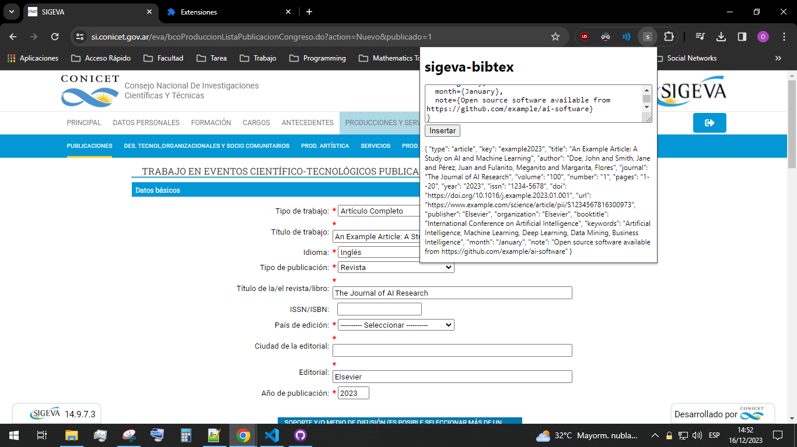

# sigeva-bibtex

La extensión fue probada solo en navegadores basados en Chromium, igual debería funcionar (mínimanente) en Firefox también.

## Instalación

1. Descargá el último [release](https://codeload.github.com/indirivacua/sigeva-bibtex/zip/refs/heads/main) del paquete de la extensión y extraélo.

2. Accedé a `chrome://extensions`. Activá la opción **Modo de desarrollador** (esquina superior derecha).

3. Hacé click en **Cargar extensión sin empaquetar** y seleccioná la carpeta donde extrajiste la extensión.

## Uso

Con algún motor de búsqueda académico como [Google Scholar](https://scholar.google.com/) obtené el bibtex del paper que querés cargar en SIGEVA.

<details><summary>Ejemplo</summary>

```bibtex
@article{example2023,
  title={An Example Article: A Study on AI and Machine Learning},
  author={Doe, John and Smith, Jane and P{\'e}rez, Juan and Fulanito, Meganito and Margarita, Flores},
  journal={The Journal of AI Research},
  volume={100},
  number={1},
  pages={1--20},
  year={2023},
  issn={1234-5678},
  country={Italia},
  city={Turín},
  doi={https://doi.org/10.1016/j.example.2023.01.001},
  isbn={978-3-16-148410-0},
  url={https://www.example.com/science/article/pii/S1234567816300973},
  publisher={Elsevier},
  organization={Elsevier},
  booktitle={International Conference on Artificial Intelligence},
  keywords={Artificial Intelligence, Machine Learning, Deep Learning, Data Mining, Business Intelligence},
  month={January},
  note={Open source software available from https://github.com/example/ai-software}
}
```

</details>

Luego hacé click en el ícono de la extensión en la barra de herramientas de Chrome mientras estás en una página compatible. Pegá el bibtex en el campo del texto y tocá el botón **Insertar**. Done.

